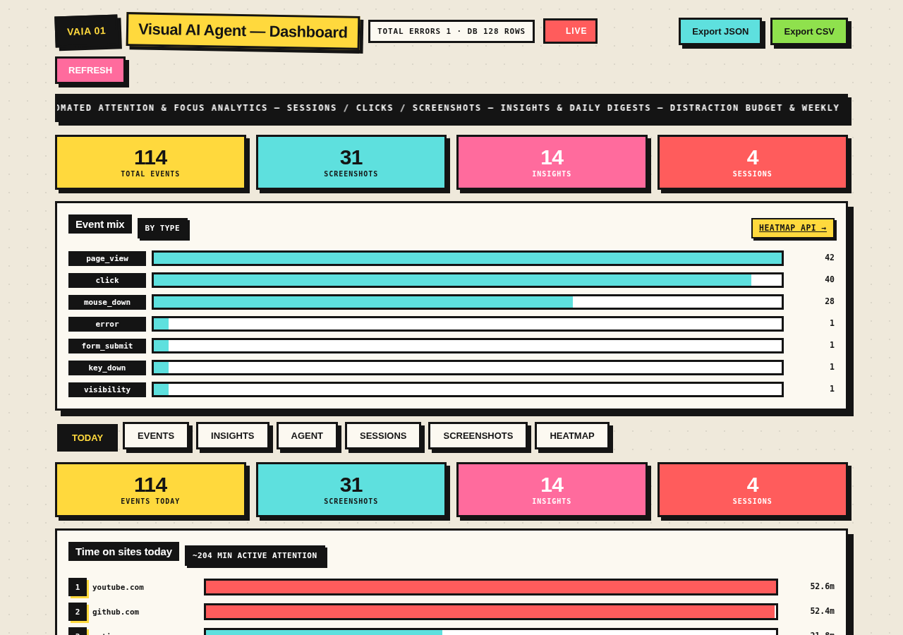
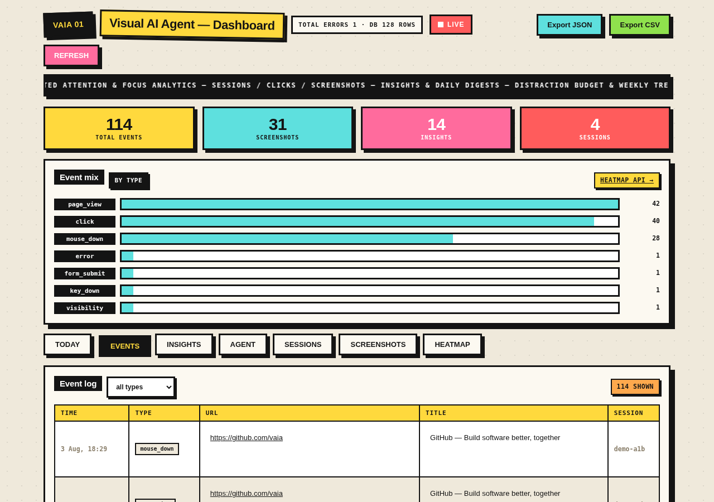
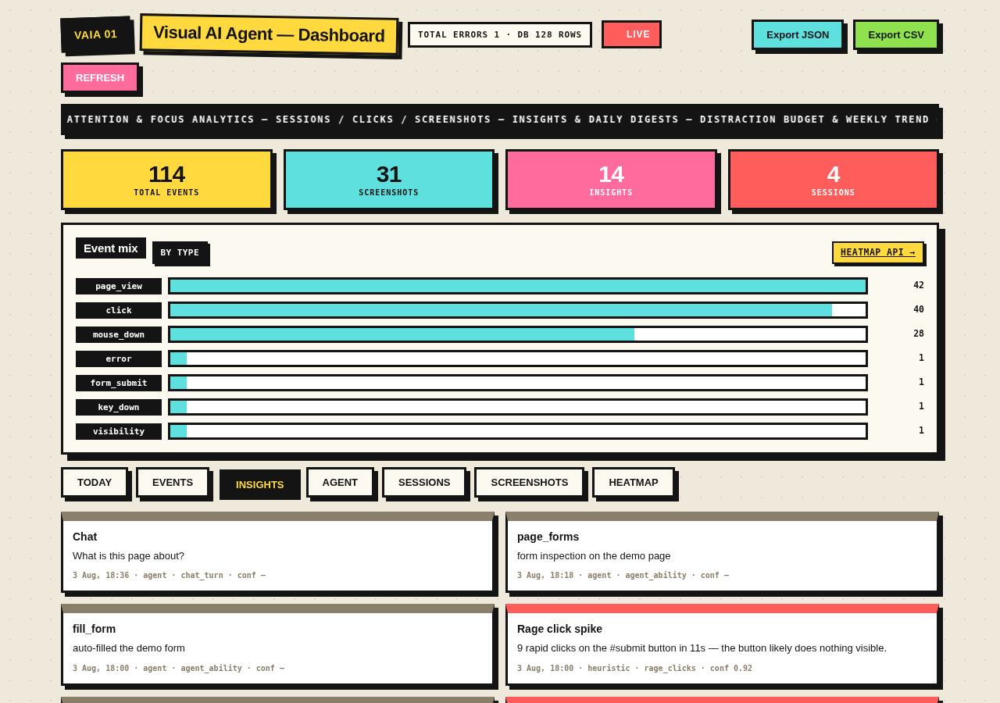
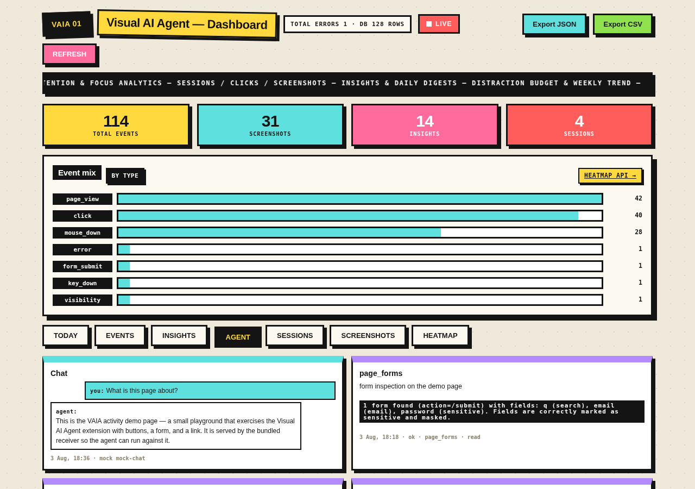
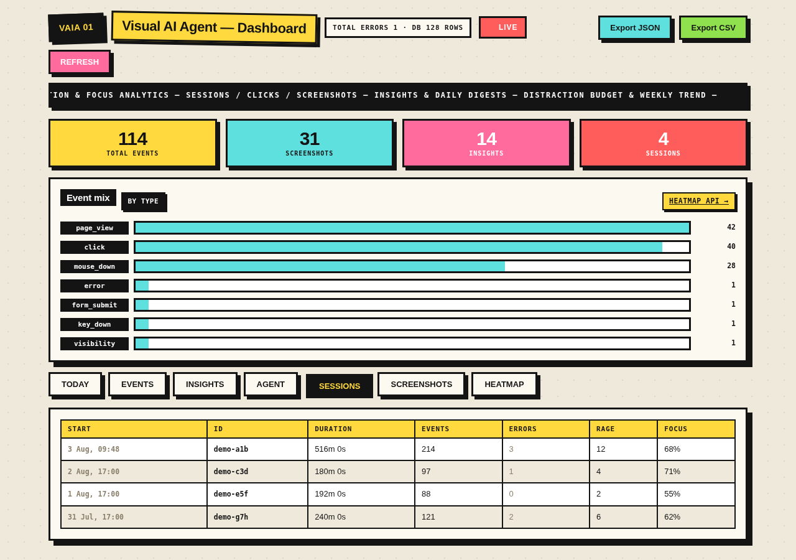
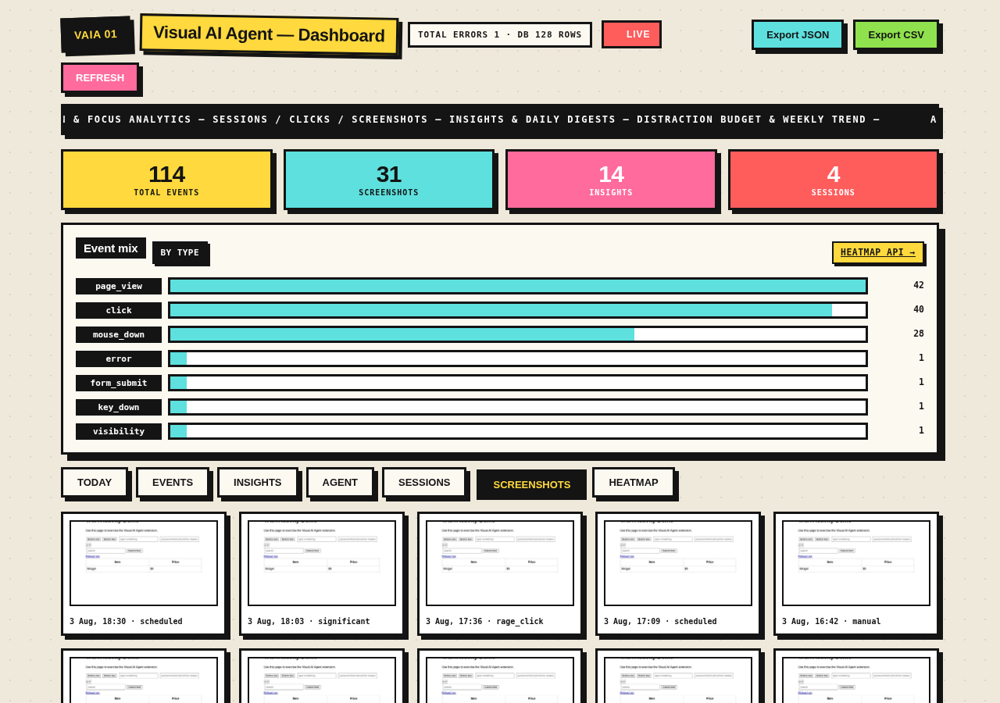
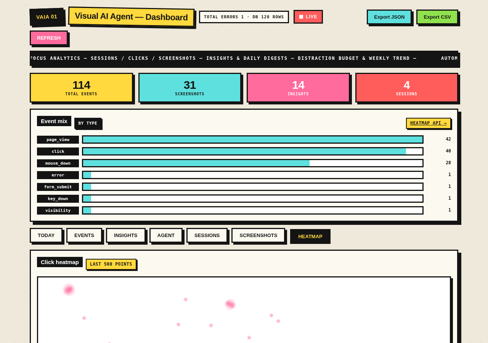

# Visual AI Agent (VAIA)

A Manifest V3 Chrome extension that **watches the browser screen and every user
interaction, analyzes it with a vision AI model, and streams structured
telemetry to your own database** (SQLite, Postgres, ClickHouse — anything with
an HTTP endpoint).

It combines the strengths of existing visual AI agents (OpenAI Operator,
Anthropic computer use, Gemini, browser-use, Microsoft Clarity, Hotjar) into a
single, local-first, privacy-respecting extension you fully control.

---

## Features

### Full activity tracking
- Mouse: move, down/up, click/double/right-click, drag, wheel, touch
- Keyboard: key up/down (keystrokes redacted), text input (values masked on
  sensitive fields), paste/copy/cut
- Page lifecycle: views, navigation, tab events, file downloads, form submits
- Errors: unhandled errors & rejections, console errors, network failures
- SPA-safe: URL-change detection without reloads

### Computer-vision screen intelligence
- Captures the visible tab, re-encodes it through an offscreen document, and
  sends it to a vision model for scene analysis (what's on screen, likely user
  intent, UI issues)
- Providers: **NVIDIA NIM** (default, OpenAI-compatible Llama vision),
  **OpenAI**, **Anthropic**, **Gemini**, **Groq**, **OpenRouter**,
  **Ollama** (local), plus an offline **mock** provider for development
- Capture triggers: periodic, on significant events (click/nav/error), manual

### Insights (heuristic + LLM)
- Rage clicks, dead clicks, rapid navigation, error spikes, form abandonment
- End-of-session LLM summaries
- Live heatmap overlay (clicks / mouse movement) rendered in the page

### Built-in agent (page reports + computer use)
The extension can act like a real browser agent (OpenAI Operator / Anthropic
computer use / browser-use) — fully offline via the `mock` provider:
- **Ask the agent** — chat about the current tab with a vision model
- **Page report** — deep page understanding from a DOM snapshot (+ optional
  screenshot): page type, summary, key points, extractable data, actions,
  forms, accessibility/UX issues, recommendations
- **Run a task** — natural-language computer use: the agent loops
  `look → decide → act` (`click` / `type` / `scroll` / `navigate`) against a
  stable element-ref snapshot (`el1`, `el2`, …) of the visible page until the
  task is done or the step budget (8) is exhausted
- Every report and task run is persisted as an insight (`page_report`,
  `task_run`) and shown in the dashboard **Agent** tab with a step-by-step
  transcript of the actions it took
- Privacy: actions are executed on the real page, but keystrokes typed by the
  agent still go through the same masking/redaction rules as the user's

### Agent abilities (73 skills) + chatbot
The agent exposes **73 well-defined abilities** — each one a named skill you can
invoke from the popup's **Agent abilities** browser or trigger from the
**Chatbot** in plain English. Grouped by category:

| Category | Skills |
| --- | --- |
| **read** (page intelligence) | DOM snapshot, read page text, list links, extract tables, inspect forms, page outline, find contacts & data, page metadata, accessibility audit, page health check, find element, summarize page, element state, readable article extraction, read clipboard, session log, current time |
| **write** (computer use) | click element, type text, clear field, select dropdown option, check/uncheck checkbox, scroll page, navigate to URL, submit form, **fill form** (auto-generates test data or uses your values; never touches sensitive fields), hover, double-click, right-click, middle-click, triple-click, mouse button down/up, key press, **hold key** (chords / long-press), drag, focus, write clipboard, **edit page** (find & replace text on the live page), **run JS** (execute a snippet in the page), wait seconds, wait for element, list/open/switch/close tabs, remember/forget, notify, download |
| **agent** (composed) | **chat** (multi-turn chatbot that sees the tab), describe screen, run a task, plan a task, deep page report, audit forms, end-to-end **UI validate** (scripted click/type/check flows), **visual check** (before/after pixel diff against a stored baseline), **deep research** (plan → search → cited report; live web search with a provider, offline otherwise), background task status/cancel (run with `async: true`, poll with `task_status`), MCP **connect/tools/call** (Streamable HTTP servers, like Claude Desktop / Gemini), **web search** / **web fetch** (Claude Desktop Web Access equivalents), **memory** remember/recall/list/forget (survives across sessions), **schedule task** (run an ability later via alarms, with a notification) |
| **meta** | take screenshot, **inspect screen region** (crop a screenshot at full resolution), viewport info, list abilities, resize window |

The **chatbot** remembers the conversation per session, sees a live DOM snapshot
of the current tab (plus a screenshot when a vision key is set), and can point
you at the right ability — e.g. *"fill the form with test data"* → `fill_form`.
Every chat turn and ability run is persisted as an insight (`chat_turn`,
`agent_ability`, `research_report`) and rendered in the dashboard **Agent** tab.
Everything works fully offline via the `mock` provider.

### Local-first database sync
- Every event is stored in IndexedDB first — the DB is an offline outbound
  queue, so nothing is lost when offline
- Batched POSTs with retry, exponential backoff, and per-record dedup
- Events, screenshots, and insights each flush to configurable endpoints

### Privacy by design
- Sensitive-field masking, keystroke redaction, URL query-stripping
- Deny/allow host lists; screenshots dropped on sensitive pages
- Retention cleanup, "clear data", full JSON export
- Everything is self-hosted — telemetry never touches a third-party cloud

---

## Install (dev)

1. `npm install` (only needed for E2E tests / icon generation)
2. `npm run icons` to generate icon PNGs
3. Open `chrome://extensions`, enable **Developer mode**, **Load unpacked**,
   select this folder
4. Optionally start the bundled receiver: `npm run server` (serves
   `http://localhost:8787`, writes to `data/telemetry.db`)

Open the popup, set your **database endpoint** and **vision provider keys** in
Options, and load any page — the dashboard (`VAIA Dashboard` button) shows the
live feed, sessions, frame replay, insights, and heatmaps.

To try the agent features offline, open the popup's **Task** card: press
**Analyze page** for a page report, or type a task (e.g. *"Click the first
button"*) and hit Run — with the default `mock` vision provider everything
works with no API key. The **Chatbot** card answers questions about the tab and
translates natural language into abilities; the **Agent abilities** card lists
all 73 skills with their arguments and a Run button. The dashboard's
**Agent** tab shows every report, task transcript, chat turn and ability run.

Screenshots of the dashboard and agent runs live in `demo/`:















## UI pages

The extension ships four surfaces:

### 1. Popup — `ui/popup/popup.html`
One-click control panel from the toolbar icon:
- **Ask** — chat with the agent about the current tab (vision-backed when a key is set)
- **Chatbot** — multi-turn conversation that remembers the session and can invoke abilities
- **Agent abilities** — browsable list of all 73 skills, each with its arguments and a
  **Run** button
- **Task** — analyze the page, run a natural-language task, or validate a scripted UI flow
- Live counters (events today, screenshots, attention), pause/resume, capture, dashboard and
  options links

### 2. Options — `ui/options/options.html`
Tabbed settings: **General**, **Tracking**, **Capture**, **Vision AI** (provider / model /
API key), **Privacy** (masking, deny/allow hosts, sensitive domains), **Database** (endpoint,
queue), **Insights** (detectors, LLM summaries).

### 3. Extension dashboard — `ui/dashboard/dashboard.html`
In-browser telemetry viewer (`Alt+Shift+D`): **Live** event feed, **Sessions**, **Replay**
(screenshot frames), **Insights**, **Heatmaps** (click/move overlay), and **Stats**.

### 4. Receiver dashboard + API — `server/`
Self-hosted reference receiver (`npm run server` → http://localhost:8787):
- Dashboard tabs: **TODAY**, **EVENTS**, **INSIGHTS**, **AGENT** (page reports, task
  transcripts, chat turns, ability runs), **SESSIONS**, **SCREENSHOTS**, **HEATMAP**
- Endpoints: `POST /api/events|screenshots|insights|sessions` for the extension,
  `GET /api/events|screenshots|insights|sessions|stats|heatmap|attention|focus|export` for
  charts and data export, plus `GET /demo` — a small page for exercising the extension
- Data lives in `data/telemetry.db` (SQLite via `node:sqlite`); frame payloads are written to
  `data/screenshots/` as JPEGs

## Keyboard shortcuts

| Shortcut | Action |
| --- | --- |
| `Alt+Shift+P` | Pause / resume monitoring |
| `Alt+Shift+C` | Capture and analyze the current screen |
| `Alt+Shift+D` | Open the VAIA dashboard |

(Rebindable in `chrome://extensions/shortcuts`.)

## Configuration

See `shared/config.js` for defaults. Key sections (editable in Options):

| Key | Purpose |
| --- | --- |
| `enabled` | Master tracking switch |
| `tracking.*` | Toggle mouse/keyboard/scroll/navigation/errors |
| `capture.enabled` | Screen capture on/off; interval, quality, maxWidth |
| `capture.storeLocal` | Keep frames locally for replay (default on) |
| `vision.provider` | `nvidia` / `openai` / `anthropic` / `gemini` / `groq` / `openrouter` / `ollama` / `mock` |
| `vision.apiKey` | Provider key (stored in `chrome.storage.local`) |
| `db.endpoint` | Receiver URL for events (e.g. `http://localhost:8787/api/events`) |
| `db.sendEvents` / `sendScreenshots` / `sendInsights` | Per-channel sync toggles |
| `db.flushIntervalMs` | Auto-flush interval (default 5s) |
| `privacy.redactKeystrokeValues` | Drop typed values entirely (default on) |
| `hosts.denylist` / `allowlist` | Skip sensitive hosts / restrict tracking |

## Receiver API

The bundled `server/server.mjs` (Node 24 `node:sqlite`) implements the wire
format used by the extension:

| Endpoint | Method | Body |
| --- | --- | --- |
| `/api/events` | POST | `{ kind:'events', deviceId, userId, events:[...] }` |
| `/api/screenshots` | POST | `{ kind:'screenshots', screenshots:[...] }` |
| `/api/insights` | POST | `{ kind:'insights', insights:[...] }` |
| `/api/sessions` | POST | `{ kind:'sessions', sessions:[...] }` |
| `/api/events\|screenshots\|insights\|sessions` | GET | read back (limit/type/from/to) |
| `/api/stats` | GET | aggregated counts + event-type distribution |
| `/api/heatmap` | GET | click coordinates |
| `/api/attention` | GET | time-per-host attention totals |
| `/api/focus` | GET | focus sessions & distraction budget breakdown |
| `/api/insights` | GET | insights with agent `kind` (page reports, task runs) |
| `/demo` | GET | a small page for exercising the extension |
| `/health` | GET | liveness |

Any server that accepts these POSTs works — the schema is intentionally flat
and JSON-serializable.

## Architecture

```
content/content.js          activity tracker + heatmap overlay
content/element-tools.js    DOM attribution, xpath/css fingerprinting, a11y
content/privacy-scan.js     sensitive-field detection (WeakSet-cached)
background/service-worker.js orchestrator: routing, sessions, tabs, flushing
background/agent.js         agentic layer: page reports + computer-use task loop
background/abilities.js     the 73-skill ability registry + chatbot history
background/capture.js       capture pipeline (offscreen re-encode)
background/vision.js        7 vision providers + offline mock
background/insights.js      heuristic detectors + LLM summaries
background/db.js            IndexedDB outbound queue, retry/backoff/dedup
background/idb.js           IndexedDB store layer (also offline archive)
offscreen/processor.js      screenshot downscale/re-encode (BLOBS reason)
ui/popup|options|dashboard  control panel, settings, live telemetry UI
server/server.mjs           reference receiver (node:sqlite)
shared/                     config + protocol constants + utils
```

Content scripts are classic scripts (no ES imports); background/UI are ES
modules. Tracking is local-first: content → port → SW → IndexedDB → batched
HTTP.

## Testing

```bash
npm test            # 140 unit tests (config, utils, element-tools, session, insights, vision, db, agent, abilities, mcp)
npm run test:integration  # live provider checks — skips without keys (NVIDIA_API_KEY or GROQ_API_KEY)
npm run e2e   # loads the real extension in headless Chrome (puppeteer-core +
              #   system Chrome), drives the /demo page, and verifies tracking,
              #   redaction, capture, vision, agent page-reports + task loop,
              #   the 73-ability registry, form filling, chatbot, deep research,
              #   tab management, web search/fetch, memory, run_js, and the
              #   full receiver round-trip
```

The live integration test runs against **NVIDIA NIM** when `NVIDIA_API_KEY` is set
(e.g. exported in `~/.bashrc`), falling back to **Groq** when `GROQ_API_KEY` is set
(see `.env.example`). Note that free tiers are token-limited and vision requests
are token-heavy, so keep `vision.maxTokens` modest.

E2E uses Chrome 137+ `Extensions.loadUnpacked` via puppeteer's
`installExtension()` because branded Chrome builds removed `--load-extension`.

## Privacy notes

- Typed values are masked on password/credit-card fields by default
- Captures and keystrokes are never sent to third parties; the receiver is
  yours
- The mock vision provider lets you run entirely offline
